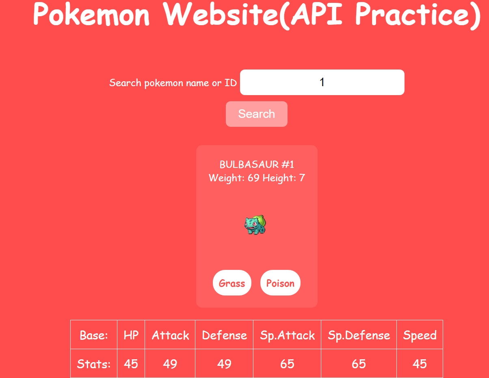
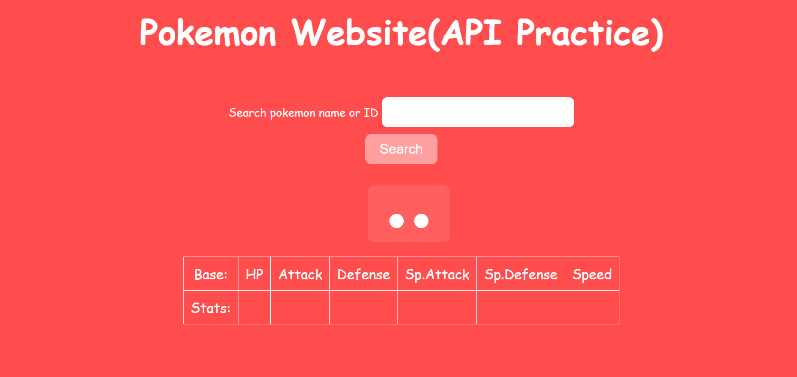
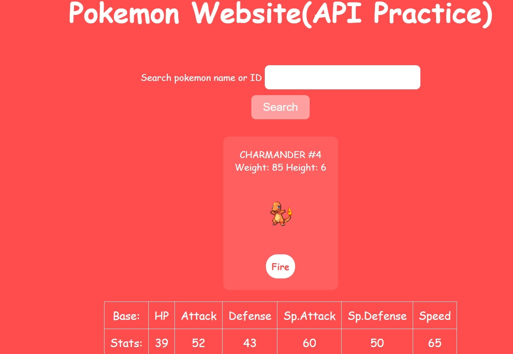

# 🌟 Pokemon Search App

A web application that allows users to search for Pokémon by name or ID and retrieve detailed information, including stats, types, and an image. Built using HTML, CSS, JavaScript, and the [PokéAPI](https://pokeapi.co/).



## 🚀 Features
- Search for any Pokémon by name or ID
- Displays Pokémon name, ID, weight, height, and image
- Shows Pokémon types and base stats (HP, Attack, Defense, etc.)
- Responsive and visually appealing UI

## Live Demo
You can see a live demo of the project [here](https://codepen.io/DevOlabode/pen/azogYbV).
## 📸 Screenshot





## 🔧 Technologies Used
- HTML
- CSS
- JavaScript
- [Axios](https://github.com/axios/axios) (for API requests)
- [PokéAPI](https://pokeapi.co/) (for Pokémon data)

## 📂 Installation
1. Clone the repository:
   ```sh
   git clone https://github.com/DevOlabode/pokemon-website.git
   ```  
2. Open `pokeAPI.html` in a browser.

## 🤝 Contributing
Feel free to submit issues or pull requests if you have any suggestions!

## 📝 License
This project is licensed under the MIT License.
